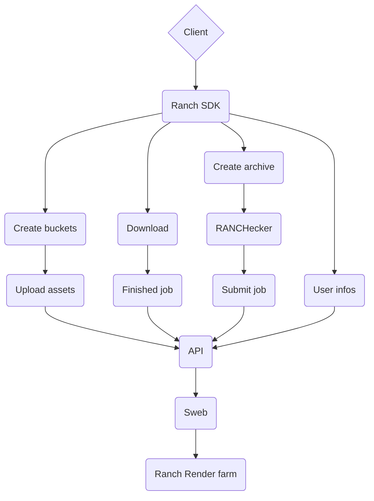
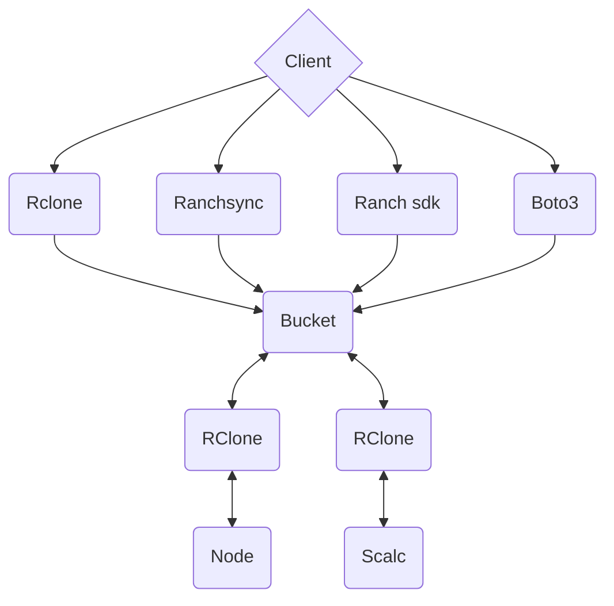

## Create setup.py
### On Mac/Linux:
```bash
- touch setup.py 
```
 
## Create new virtual environment
```bash
- python -m venv env
```

## Create .pypirc file in $HOME directory
```bash
touch ~/.pypirc
```

## Activate the environment
# On Mac/Linux:
```bash
source env/bin/activate
```

## On Windows:
```powershell
call env\Scripts\activate.bat
```

## updrade pip
```bash
- python -m pip install --upgrade pip
```

## Install wheel and twine
```bash
- pip install wheel
- pip install twine
```


## Run setup
```bash
- python setup.py bdist_wheel
```

## Check if dist is correct setup
```bash
- twine check dist/*
```

## upload test package with twine to [test.pypi](https://test.pypi.org/manage/account/)
```bash
twine upload -r test-ranch-pypi dist/*
```

## upload package with twine
```bash
- twine upload -r pypi dist/*
```

## Install nox
```bash
- pip install nox
```

## Testing package
```bash
- pip install -e .
- import ranch
- ranch.__version__
```

## Generate sphinx docs
```bash
- cd ranch-sdk-python
- nox
```

### Ranch SDK workflow




# Bucket

