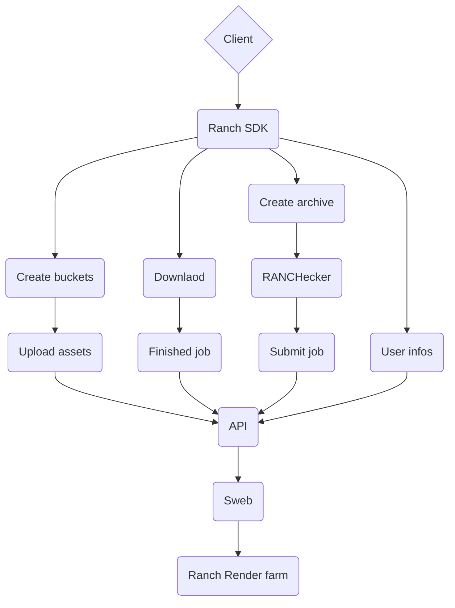
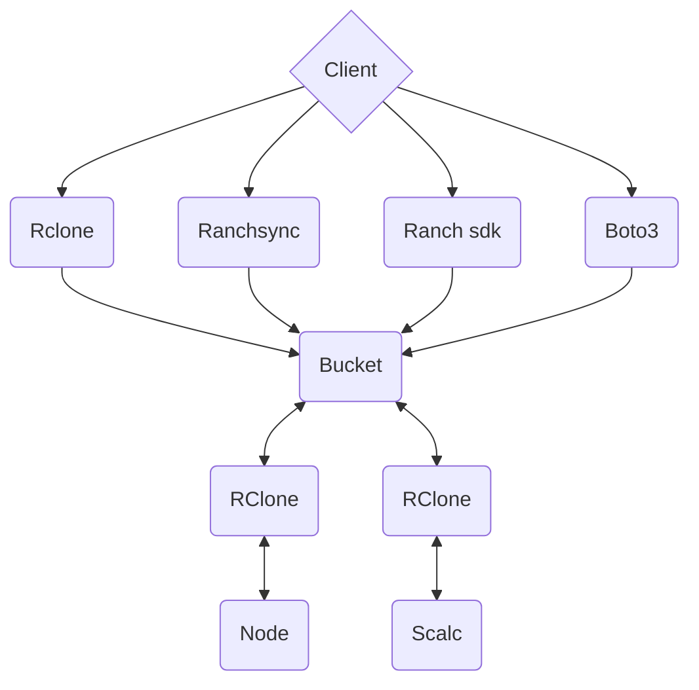

# Ranch python SDK
This Python-based API SDK Designed with future production in mind, its goal is to unify the development of the Ranchecker application and facilitate external customers in integrating their pipelines with our render farm. This SDK stands as a bridge between external pipelines and our rendering services, potentially opening new avenues for collaboration and efficiency in rendering workflows.

### Example python script

Here is a little sample script with python submit a job to the ranchcomputing render farm with cinema 4d R23 and Arnold renderer 

```python
import os
from ranch.connection import Connect
from ranch import ranchecker

RANCH_API_KEY = os.getenv("RANCH_API_KEY")
Username = os.environ.get("g_licenseUsername")
Password = os.environ.get("g_licensePassword")
scene = "C:\\Users\\mohbakh\\Pictures\\car\\sdk.c4d"
c4d_commandline = "C:\\Maxon\\C4D2023\\Commandline.exe"

conn = Connect(RANCH_API_KEY)
ranch_rc = ranchecker.Ranchecker()
vuc_archive_path = ranch_rc.create_archive(software_commandline=c4d_commandline, 
            g_licenseUsername=Username, 
            g_licensePassword=Password, 
            scene_destination=scene)
job = self.conn.create_job(
            archive_path=vuc_archive_path,
            job_name="sdk_job",
            priority="cpu-low",
            software="cinema4d",
            software_version="R23",
            renderer_name="Arnold",
        )
res = self.conn.submit(job)

```

### Ranch SDK workflow




# Bucket

